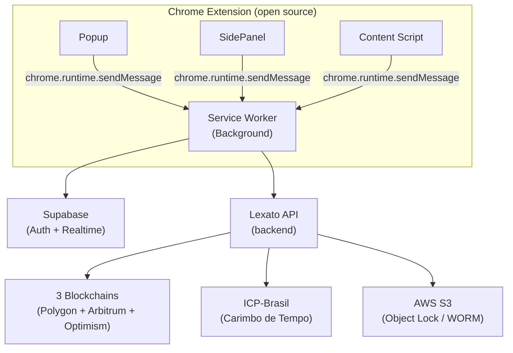

# Lexato Chrome Extension

> A primeira e única extensão de captura de provas digitais open source do Brasil — código aberto, auditável e verificável por qualquer pessoa.

[](https://github.com/LexatoBR/lexato-extension)
[](LICENSE)
[](https://chromewebstore.google.com)
[](https://developer.chrome.com/docs/extensions/mv3/)
[](SECURITY.md)
[](https://github.com/LexatoBR/lexato-extension)

---

## Por que open source?

A [Lexato](https://lexato.com.br) acredita que uma ferramenta de captura de provas digitais só tem credibilidade real se qualquer pessoa puder auditar o código que coleta, processa e certifica as evidências.

Diferente de soluções proprietárias onde o usuário precisa confiar cegamente no fornecedor, aqui você pode verificar por conta própria:

- Como os hashes SHA-256 são gerados e encadeados
- Como a árvore Merkle é construída para garantir integridade
- Como o modo lockdown protege a captura contra manipulação
- Como os metadados forenses são coletados (DNS, WHOIS, geolocalização, headers HTTP)
- Como a comunicação com o backend é protegida

Somos a única ferramenta de captura de provas digitais no Brasil com código 100% aberto e auditável. Transparência não é um diferencial — é um requisito para quem leva segurança a sério.

## O que é a Lexato?

A [Lexato](https://lexato.com.br) é uma plataforma brasileira de registro e certificação de provas digitais com validade jurídica, projetada para advogados, escritórios de advocacia, departamentos jurídicos e profissionais que precisam de evidências digitais confiáveis.

Esta extensão Chrome é o ponto de entrada para captura de evidências diretamente do navegador. Após a captura, o processamento continua no backend da [Lexato](https://lexato.com.br) com certificação blockchain e carimbo ICP-Brasil.

Saiba mais em [lexato.com.br](https://lexato.com.br).

## Recursos Exclusivos

Tecnologias e funcionalidades únicas no mercado de certificação digital brasileiro:

| Recurso | Descrição |
|---------|-----------|
| Zero Trust | Arquitetura onde nenhum componente confia implicitamente em outro — verificação contínua em cada etapa |
| 3 Blockchains | Registro simultâneo em Polygon, Arbitrum e Optimism — redundância e imutabilidade em múltiplas redes |
| 100% Open Source | Código-fonte aberto e auditável — a única ferramenta de captura de provas digitais do Brasil com essa transparência |
| Pós-Quântico (ML-DSA-87) | Algoritmo de assinatura digital resistente a computação quântica, conforme FIPS 204 |
| FIPS 140-3 | Criptografia AES-256-GCM em conformidade com o padrão federal americano de segurança |
| S3 Object Lock | Armazenamento imutável com WORM (Write Once Read Many) — evidências não podem ser alteradas ou excluídas |
| Suporte 24/7 | Atendimento contínuo para questões técnicas e jurídicas via [lexato.com.br/suporte](https://lexato.com.br/suporte) |

## Funcionalidades da Extensão

- **Captura de screenshot e vídeo** com hash criptográfico SHA-256 gerado no momento da coleta
- **Metadados forenses automatizados** — IP, geolocalização, DNS, WHOIS, cabeçalhos HTTP, certificados SSL
- **Modo lockdown** — desativa DevTools e extensões de terceiros durante a captura para garantir autenticidade
- **Isolamento de extensões** — desativa temporariamente todas as outras extensões do Chrome durante a gravação
- **Árvore Merkle** — estrutura criptográfica que garante integridade de cada artefato individualmente
- **Cadeia de custódia digital** — rastreabilidade completa desde a captura até a certificação final
- **Certificação blockchain** automática após a captura (Polygon + Arbitrum + Optimism)
- **Carimbo de tempo ICP-Brasil** — validade jurídica via Autoridade Certificadora credenciada
- **Sincronização em tempo real** com o painel [Lexato](https://lexato.com.br) via Supabase Realtime
- **Histórico de capturas** acessível diretamente do Side Panel
- **Internacionalização** — interface disponível em português, inglês e espanhol

## Segurança: Arquitetura Zero Trust

A [Lexato](https://lexato.com.br) adota uma arquitetura **Zero Trust** — nenhum componente confia implicitamente em outro. Cada operação é verificada, cada artefato é validado, cada comunicação é autenticada.

### Princípios Zero Trust aplicados

| Princípio | Implementação na extensão |
|-----------|---------------------------|
| **Nunca confiar, sempre verificar** | Tokens JWT validados em cada requisição; hashes recalculados em cada etapa da cadeia de custódia |
| **Menor privilégio** | Permissões Chrome declaradas no manifest são as mínimas necessárias; `activeTab` em vez de `<all_urls>` |
| **Verificação contínua** | Integridade do DOM monitorada durante toda a captura via `MutationObserver`; DevTools detectados em tempo real |
| **Criptografia em trânsito e em repouso** | HTTPS obrigatório para todas as comunicações; AES-256-GCM (FIPS 140-3) para armazenamento local |
| **Isolamento de contexto** | Service Worker isolado (Manifest V3); extensões de terceiros desativadas durante captura |
| **Auditabilidade total** | Código 100% aberto; logs de auditoria com correlation ID em cada operação |

### Transparência

- **Código aberto e auditável** — qualquer pesquisador de segurança pode inspecionar o código-fonte completo
- **Auditorias independentes** — qualquer pessoa pode auditar, testar e validar o comportamento da extensão
- **Sem telemetria oculta** — nenhum dado é coletado sem consentimento explícito do usuário
- **Changelog público** — todas as alterações são rastreáveis via histórico de commits

### Privacidade

- **Dados do usuário nunca saem do dispositivo** sem ação explícita de captura
- **Geolocalização apenas com consentimento** — solicitada antes de cada captura, nunca em background
- **Sem cookies de rastreamento** — autenticação via tokens JWT armazenados localmente com criptografia
- **Sem acesso a histórico de navegação** — a extensão só interage com a aba ativa no momento da captura
- **Conformidade com LGPD** — dados pessoais tratados conforme a Lei Geral de Proteção de Dados

### Conformidade e padrões

| Padrão | Aplicação |
|--------|-----------|
| **FIPS 140-3** | Criptografia AES-256-GCM para armazenamento local |
| **FIPS 204 (ML-DSA-87)** | Assinatura digital pós-quântica |
| **ISO/IEC 27037** | Coleta e preservação de evidências digitais |
| **CPP Arts. 158-A a 158-F** | Cadeia de custódia conforme Código de Processo Penal |
| **ICP-Brasil** | Carimbo de tempo com validade jurídica |
| **LGPD** | Proteção de dados pessoais |
| **Manifest V3** | Arquitetura mais segura do Chrome com Service Worker isolado |

### Medidas técnicas

- **Content Security Policy restritiva** — sem `unsafe-eval`, sem `unsafe-inline`
- **Source maps nunca incluídos** no bundle de produção
- **S3 Object Lock (WORM)** — evidências armazenadas de forma imutável na AWS
- **Testes de propriedade** (property-based testing) para validação de invariantes criptográficas
- **Circuit breaker** por serviço para resiliência contra falhas em cascata

Para reportar vulnerabilidades, veja [SECURITY.md](SECURITY.md).

## Arquitetura



## Pré-requisitos

| Ferramenta | Versão mínima |
|------------|---------------|
| Node.js    | 20.x          |
| npm        | 10.x          |
| Chrome     | 116+          |

## Instalação para Desenvolvimento

### 1. Clone o repositório

```bash
git clone https://github.com/LexatoBR/lexato-extension.git
cd lexato-extension
```

### 2. Instale as dependências

```bash
npm install
```

### 3. Configure as variáveis de ambiente

```bash
cp .env.example .env.local
```

Edite `.env.local` com suas credenciais (veja `.env.example` para instruções).

### 4. Build de desenvolvimento

```bash
npm run dev
```

### 5. Carregue a extensão no Chrome

1. Abra `chrome://extensions/`
2. Ative **"Modo do desenvolvedor"** (canto superior direito)
3. Clique em **"Carregar sem compactação"**
4. Selecione a pasta `dist/` gerada

## Scripts Disponíveis

```bash
npm run dev           # Build de desenvolvimento (com watch)
npm run build         # Build de produção
npm run build:prod    # Build + validação do manifest
npm run typecheck     # Verificação de tipos TypeScript
npm run lint          # Lint do código
npm run lint:fix      # Lint com correção automática
npm run test          # Executa testes unitários
npm run test:watch    # Testes em modo watch
npm run test:coverage # Cobertura de testes
```

## Estrutura do Projeto

```
src/
├── background/           # Service Worker — orquestração, autenticação, API
├── config/               # Configuração de ambientes
├── content/              # Content Scripts — injeção em páginas web
├── capture-bridge/       # Bridge de comunicação para captura
├── hooks/                # React hooks compartilhados
├── lib/                  # Bibliotecas core
│   ├── csp/              # Content Security Policy builder
│   ├── crypto/           # Criptografia, hashing e AES-256-GCM
│   ├── evidence-pipeline/# Pipeline de processamento de evidências
│   ├── forensic/         # Coleta forense (DNS, WHOIS, geolocalização)
│   ├── notifications/    # Notificações em tempo real (Supabase Realtime)
│   └── supabase/         # Cliente Supabase configurado para extensões
├── offscreen/            # Documento offscreen (APIs que requerem DOM)
├── options/              # Página de configurações da extensão
├── overlay/              # UI de overlay injetada nas páginas
├── popup/                # Popup principal da extensão
├── preview/              # Preview de capturas
├── sidepanel/            # Side Panel — controles de gravação
├── store/                # Estado global (Zustand) com persist em chrome.storage
├── styles/               # Design tokens (cores, tipografia, espaçamento)
├── types/                # Tipos TypeScript compartilhados
└── manifest.ts           # Definição do Manifest V3
tests/
├── unit/                 # Testes unitários (Vitest)
├── integration/          # Testes de integração
└── property/             # Testes baseados em propriedades (fast-check)
```

## Comparativo com Outras Soluções

| Característica | Lexato | Soluções proprietárias |
|----------------|--------|------------------------|
| Código-fonte aberto | Sim — 100% auditável | Não |
| Arquitetura Zero Trust | Sim — verificação contínua em cada etapa | Não documentado |
| Auditoria independente | Sim — qualquer pessoa pode auditar | Não |
| Blockchain (3 redes) | Polygon + Arbitrum + Optimism | Geralmente 1 rede ou nenhuma |
| Criptografia pós-quântica | ML-DSA-87 (FIPS 204) | Não |
| Armazenamento imutável | S3 Object Lock (WORM) | Variável |
| Carimbo ICP-Brasil | Sim | Variável |
| Coleta forense automatizada | DNS, WHOIS, geolocalização, SSL, HTTP headers | Parcial |
| Modo lockdown | Desativa DevTools + extensões de terceiros | Não |
| Privacidade (LGPD) | Sem telemetria oculta; geolocalização com consentimento | Variável |
| Internacionalização | pt-BR, en, es | Geralmente apenas 1 idioma |

## Contribuindo

Contribuições são bem-vindas. Veja [CONTRIBUTING.md](CONTRIBUTING.md) para o guia completo.

A [Lexato](https://lexato.com.br) valoriza contribuições da comunidade, especialmente em:

- Revisão de segurança e auditorias independentes
- Melhorias na coleta forense
- Traduções para novos idiomas
- Testes de propriedade para invariantes criptográficas
- Documentação técnica e jurídica

## Licença

Apache 2.0 — veja [LICENSE](LICENSE) para detalhes.

Copyright (c) 2024-2026 [Lexato](https://lexato.com.br). Todos os direitos reservados.

---

Desenvolvido com arquitetura Zero Trust, foco em transparência, privacidade e validade jurídica por [Lexato](https://lexato.com.br) — a plataforma de certificação de provas digitais do mercado jurídico brasileiro.
