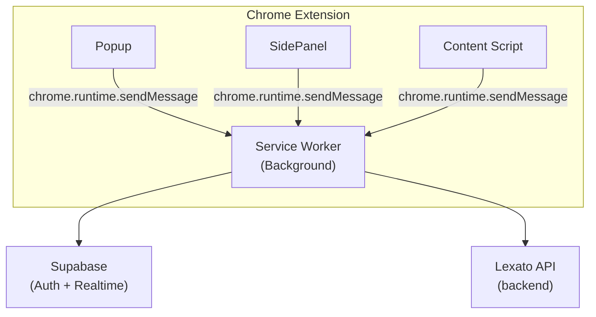

# Lexato Chrome Extension

> Extensão Chrome open source para captura e certificação de provas digitais com validade jurídica — blockchain + ICP-Brasil.

[](https://github.com/LexatoBR/lexato-extension)
[](LICENSE)
[](https://chromewebstore.google.com)
[](https://developer.chrome.com/docs/extensions/mv3/)

## O que é a Lexato?

A [Lexato](https://lexato.com.br) é uma plataforma brasileira de registro e certificação de provas digitais que combina:

- **Blockchain** (Polygon, Arbitrum, Optimism) para imutabilidade das evidências
- **ICP-Brasil** para assinatura digital com validade jurídica
- **Coleta forense** automatizada (geolocalização, metadados DNS/WHOIS, hash SHA-256, vídeo da sessão)

Esta extensão Chrome é o ponto de entrada para captura de evidências diretamente do navegador.

## Funcionalidades

- **Captura de screenshot e vídeo** com hash criptográfico SHA-256
- **Certificação blockchain** automática após a captura
- **Metadados forenses** — IP, geolocalização, DNS, WHOIS, cabeçalhos HTTP
- **Modo lockdown** — bloqueia DevTools durante a gravação para garantir autenticidade
- **Sincronização em tempo real** com o painel Lexato via Supabase Realtime
- **Histórico de capturas** acessível diretamente do Side Panel

## Pré-requisitos

| Ferramenta | Versão mínima |
|------------|---------------|
| Node.js    | 20.x          |
| npm        | 10.x          |
| Chrome     | 116+          |

## Instalação para Desenvolvimento

### 1. Clone o repositório
```bash
git clone https://github.com/LexatoBR/lexato-extension.git
cd lexato-extension
```

### 2. Instale as dependências
```bash
npm install
```

### 3. Configure as variáveis de ambiente
```bash
cp .env.example .env.local
```

Edite `.env.local` com suas credenciais (veja `.env.example` para instruções).

### 4. Build de desenvolvimento
```bash
npm run dev
```

### 5. Carregue a extensão no Chrome

1. Abra `chrome://extensions/`
2. Ative **"Modo do desenvolvedor"** (canto superior direito)
3. Clique em **"Carregar sem compactação"**
4. Selecione a pasta `dist/` gerada

## Scripts Disponíveis

```bash
npm run dev          # Build de desenvolvimento (com watch)
npm run build        # Build de produção
npm run build:prod   # Build + validação do manifest
npm run typecheck    # Verificação de tipos TypeScript
npm run lint         # Lint do código
npm run lint:fix     # Lint com correção automática
npm run test         # Executa testes unitários
npm run test:watch   # Testes em modo watch
npm run test:coverage # Cobertura de testes
```

## Estrutura do Projeto

```
src/
├── background/        # Service Worker — orquestração, autenticação, API
├── config/            # Configuração de ambientes
├── content/           # Content Scripts — injeção em páginas web
├── capture-bridge/    # Bridge de comunicação para captura
├── hooks/             # React hooks compartilhados
├── lib/               # Bibliotecas core
│   ├── csp/           # Content Security Policy builder
│   ├── crypto/        # Criptografia e hashing
│   ├── evidence-pipeline/ # Pipeline de processamento de evidências
│   ├── forensic/      # Coleta forense (DNS, WHOIS, geoloc)
│   ├── notifications/ # Notificações em tempo real (Supabase Realtime)
│   └── supabase/      # Cliente Supabase configurado para extensões
├── offscreen/         # Documento offscreen (APIs que requerem DOM)
├── options/           # Página de configurações da extensão
├── overlay/           # UI de overlay injetada nas páginas
├── popup/             # Popup principal da extensão
├── preview/           # Preview de capturas
├── sidepanel/         # Side Panel — controles de gravação
├── store/             # Estado global (Zustand) com persist em chrome.storage
├── styles/            # Design tokens (cores, tipografia, espaçamento)
├── types/             # Tipos TypeScript compartilhados
└── manifest.ts        # Definição do Manifest V3
tests/
├── unit/              # Testes unitários (Vitest)
└── property/          # Testes baseados em propriedades (fast-check)
```

## Arquitetura



## Segurança

- Tokens JWT armazenados com criptografia **AES-256-GCM** via `chrome.storage.local`
- Source maps **nunca incluídos** no bundle de produção
- Content Security Policy restritiva (sem `unsafe-eval`, sem `unsafe-inline`)
- Modo lockdown bloqueia DevTools durante capturas para garantir autenticidade forense

Para reportar vulnerabilidades, veja [SECURITY.md](SECURITY.md).

## Contribuindo

Veja [CONTRIBUTING.md](CONTRIBUTING.md) para guias de contribuição.

## Licença

Apache 2.0 © [Lexato](https://lexato.com.br) — veja [LICENSE](LICENSE) para detalhes.
