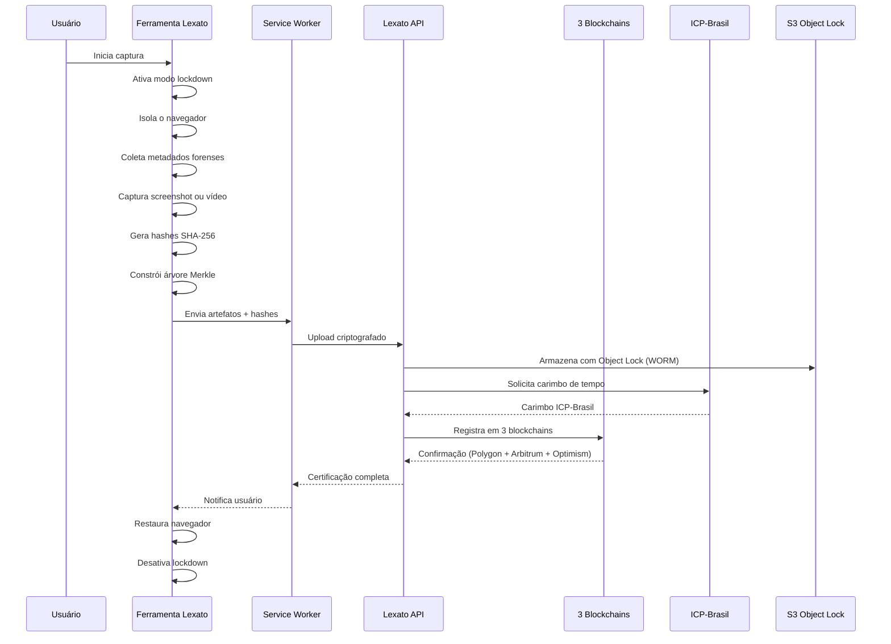
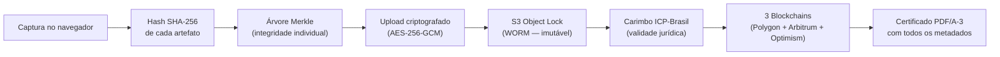
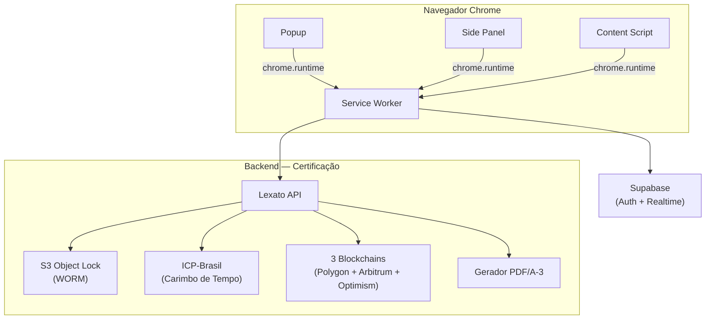

<p align="center">
  <a href="https://lexato.com.br">
    
  </a>
</p>

<h1 align="center">Lexato — Captura de Provas Digitais</h1>

<p align="center">
  A primeira e única ferramenta de captura de provas digitais <strong>open source</strong> do Brasil.<br/>
  Código aberto, auditável e verificável por qualquer pessoa.
</p>

<p align="center">
  <a href="https://github.com/LexatoBR/lexato-extension"></a>
  <a href="LICENSE"></a>
  <a href="https://chromewebstore.google.com"></a>
  <a href="https://developer.chrome.com/docs/extensions/mv3/"></a>
  <a href="SECURITY.md"></a>
  <a href="https://github.com/LexatoBR/lexato-extension"></a>
</p>

---

## Sumário

- [Por que open source?](#por-que-open-source)
- [O que é a Lexato?](#o-que-é-a-lexato)
- [Recursos exclusivos](#recursos-exclusivos)
- [Como funciona](#como-funciona)
- [Segurança: Zero Trust](#segurança-zero-trust)
- [Comparativo](#comparativo)
- [Início rápido](#início-rápido)
- [Estrutura do projeto](#estrutura-do-projeto)
- [Scripts disponíveis](#scripts-disponíveis)
- [Contribuindo](#contribuindo)
- [Licença](#licença)

---

## Por que open source?

Uma prova digital só tem valor se o processo de coleta for confiável. E confiança, no contexto forense, exige verificabilidade.

A [Lexato](https://lexato.com.br) publica o código-fonte completo da ferramenta de captura para que qualquer pessoa — advogados, peritos, pesquisadores de segurança, juízes — possa inspecionar exatamente o que acontece no momento da coleta:

- Como os hashes SHA-256 são gerados e encadeados
- Como a árvore Merkle é construída para garantir integridade individual de cada artefato
- Como o modo lockdown protege a captura contra manipulação (DevTools, outras ferramentas do navegador)
- Como os metadados forenses são coletados (DNS, WHOIS, geolocalização, headers HTTP, certificados SSL)
- Como a comunicação com o backend é autenticada e protegida

Nenhuma outra ferramenta de captura de provas digitais no Brasil oferece esse nível de transparência. Soluções proprietárias pedem que você confie cegamente — a Lexato pede que você verifique.

---

## O que é a Lexato?

A [Lexato](https://lexato.com.br) é uma plataforma brasileira de certificação de provas digitais com validade jurídica, projetada para advogados, escritórios de advocacia, departamentos jurídicos e profissionais que precisam de evidências digitais confiáveis e admissíveis em juízo.

A plataforma combina três pilares de certificação:

| Pilar | Tecnologia | Finalidade |
|-------|------------|------------|
| **Blockchain** | Polygon, Arbitrum, Optimism | Registro imutável e descentralizado em 3 redes simultâneas |
| **ICP-Brasil** | Autoridade Certificadora credenciada | Carimbo de tempo com validade jurídica no Brasil |
| **Armazenamento WORM** | AWS S3 Object Lock | Evidências que não podem ser alteradas ou excluídas |

Esta ferramenta é o ponto de entrada — captura a evidência diretamente no navegador com coleta forense automatizada. O processamento continua no backend da [Lexato](https://lexato.com.br) com certificação blockchain, carimbo ICP-Brasil e armazenamento imutável.

Saiba mais em **[lexato.com.br](https://lexato.com.br)**.

---

## Recursos exclusivos

Tecnologias e funcionalidades únicas no mercado de certificação digital brasileiro:

| | Recurso | Descrição |
|---|---------|-----------|
| **Zero Trust** | Arquitetura de segurança | Nenhum componente confia implicitamente em outro — verificação contínua em cada etapa |
| **3 Blockchains** | Redundância descentralizada | Registro simultâneo em Polygon, Arbitrum e Optimism |
| **100% Open Source** | Transparência total | A única ferramenta de captura de provas digitais do Brasil com código aberto |
| **ML-DSA-87** | Criptografia pós-quântica | Assinatura digital resistente a computação quântica (FIPS 204) |
| **AES-256-GCM** | Criptografia FIPS 140-3 | Padrão federal americano para armazenamento seguro |
| **S3 Object Lock** | Armazenamento WORM | Write Once Read Many — evidências imutáveis após gravação |
| **Suporte 24/7** | Atendimento contínuo | Questões técnicas e jurídicas via [lexato.com.br/suporte](https://lexato.com.br/suporte) |

### Funcionalidades

- **Captura de screenshot e vídeo** com hash criptográfico SHA-256 gerado no momento da coleta
- **Metadados forenses automatizados** — IP, geolocalização, DNS, WHOIS, cabeçalhos HTTP, certificados SSL
- **Modo lockdown** — desativa DevTools e ferramentas de terceiros durante a captura para garantir autenticidade
- **Isolamento do navegador** — desativa temporariamente todas as outras ferramentas do Chrome durante a gravação
- **Árvore Merkle** — estrutura criptográfica que garante integridade de cada artefato individualmente
- **Cadeia de custódia digital** — rastreabilidade completa desde a captura até a certificação final
- **Certificação blockchain** automática após a captura (Polygon + Arbitrum + Optimism)
- **Carimbo de tempo ICP-Brasil** — validade jurídica via Autoridade Certificadora credenciada
- **Sincronização em tempo real** com o painel [Lexato](https://lexato.com.br) via Supabase Realtime
- **Histórico de capturas** acessível diretamente do Side Panel
- **Internacionalização** — interface disponível em português, inglês e espanhol

---

## Como funciona

### Fluxo de captura



### Cadeia de custódia



### Arquitetura



---

## Segurança: Zero Trust

A [Lexato](https://lexato.com.br) adota uma arquitetura **Zero Trust** — nenhum componente confia implicitamente em outro. Cada operação é verificada, cada artefato é validado, cada comunicação é autenticada.

### Princípios

| Princípio | Como aplicamos |
|-----------|----------------|
| **Nunca confiar, sempre verificar** | Tokens JWT validados em cada requisição; hashes recalculados em cada etapa da cadeia de custódia |
| **Menor privilégio** | Permissões declaradas no manifest são as mínimas necessárias; `activeTab` em vez de `<all_urls>` |
| **Verificação contínua** | Integridade do DOM monitorada durante toda a captura via `MutationObserver`; DevTools detectados em tempo real |
| **Criptografia em trânsito e em repouso** | HTTPS obrigatório; AES-256-GCM (FIPS 140-3) para armazenamento local |
| **Isolamento de contexto** | Service Worker isolado (Manifest V3); ferramentas de terceiros desativadas durante captura |
| **Auditabilidade total** | Código 100% aberto; logs de auditoria com correlation ID em cada operação |

### Transparência

- **Código aberto e auditável** — qualquer pesquisador de segurança pode inspecionar o código-fonte completo
- **Auditorias independentes** — qualquer pessoa pode auditar, testar e validar o comportamento do sistema
- **Sem telemetria oculta** — nenhum dado é coletado sem consentimento explícito do usuário
- **Changelog público** — todas as alterações são rastreáveis via histórico de commits

### Privacidade

- **Dados do usuário nunca saem do dispositivo** sem ação explícita de captura
- **Geolocalização apenas com consentimento** — solicitada antes de cada captura, nunca em background
- **Sem cookies de rastreamento** — autenticação via tokens JWT armazenados localmente com criptografia
- **Sem acesso a histórico de navegação** — o sistema só interage com a aba ativa no momento da captura
- **Conformidade com LGPD** — dados pessoais tratados conforme a Lei Geral de Proteção de Dados

### Conformidade

| Padrão | Aplicação |
|--------|-----------|
| **FIPS 140-3** | Criptografia AES-256-GCM para armazenamento local |
| **FIPS 204 (ML-DSA-87)** | Assinatura digital pós-quântica |
| **ISO/IEC 27037** | Coleta e preservação de evidências digitais |
| **CPP Arts. 158-A a 158-F** | Cadeia de custódia conforme Código de Processo Penal |
| **ICP-Brasil** | Carimbo de tempo com validade jurídica |
| **LGPD** | Proteção de dados pessoais |

<details>
<summary>Medidas técnicas detalhadas</summary>

- Content Security Policy restritiva — sem `unsafe-eval`, sem `unsafe-inline`
- Source maps nunca incluídos no bundle de produção
- S3 Object Lock (WORM) — evidências armazenadas de forma imutável
- Testes de propriedade (property-based testing) para validação de invariantes criptográficas
- Circuit breaker por serviço para resiliência contra falhas em cascata
- Manifest V3 — arquitetura mais segura do Chrome com Service Worker isolado

</details>

Para reportar vulnerabilidades, veja [SECURITY.md](SECURITY.md).

---

## Comparativo

| Característica | Lexato | Soluções proprietárias |
|----------------|--------|------------------------|
| Código-fonte aberto | 100% auditável | Fechado |
| Arquitetura Zero Trust | Verificação contínua em cada etapa | Não documentado |
| Auditoria independente | Qualquer pessoa pode auditar | Indisponível |
| Blockchain | 3 redes simultâneas (Polygon + Arbitrum + Optimism) | 1 rede ou nenhuma |
| Criptografia pós-quântica | ML-DSA-87 (FIPS 204) | Indisponível |
| Armazenamento imutável | S3 Object Lock (WORM) | Variável |
| Carimbo ICP-Brasil | Sim | Variável |
| Coleta forense | DNS, WHOIS, geolocalização, SSL, HTTP headers | Parcial |
| Modo lockdown | DevTools + ferramentas de terceiros desativados | Indisponível |
| Privacidade (LGPD) | Sem telemetria oculta; geolocalização com consentimento | Variável |
| Internacionalização | pt-BR, en, es | Geralmente 1 idioma |

---

## Início rápido

### Pré-requisitos

| Ferramenta | Versão mínima |
|------------|---------------|
| Node.js    | 20.x          |
| npm        | 10.x          |
| Chrome     | 116+          |

### Instalação

```bash
# 1. Clone o repositório
git clone https://github.com/LexatoBR/lexato-extension.git
cd lexato-extension

# 2. Instale as dependências
npm install

# 3. Configure as variáveis de ambiente
cp .env.example .env.local
# Edite .env.local com suas credenciais (veja .env.example)

# 4. Build de desenvolvimento
npm run dev
```

### Carregando no Chrome

1. Abra `chrome://extensions/`
2. Ative **"Modo do desenvolvedor"** (canto superior direito)
3. Clique em **"Carregar sem compactação"**
4. Selecione a pasta `dist/` gerada

---

## Estrutura do projeto

```
src/
├── background/           # Service Worker — orquestração, autenticação, API
├── config/               # Configuração de ambientes
├── content/              # Content Scripts — injeção em páginas web
├── capture-bridge/       # Bridge de comunicação para captura
├── hooks/                # React hooks compartilhados
├── lib/                  # Bibliotecas core
│   ├── csp/              # Content Security Policy builder
│   ├── crypto/           # Criptografia, hashing e AES-256-GCM
│   ├── evidence-pipeline/# Pipeline de processamento de evidências
│   ├── forensic/         # Coleta forense (DNS, WHOIS, geolocalização)
│   ├── notifications/    # Notificações em tempo real (Supabase Realtime)
│   └── supabase/         # Cliente Supabase
├── offscreen/            # Documento offscreen (APIs que requerem DOM)
├── options/              # Página de configurações
├── overlay/              # UI de overlay durante captura
├── popup/                # Interface principal
├── preview/              # Preview de capturas
├── sidepanel/            # Side Panel — controles de gravação
├── store/                # Estado global (Zustand + chrome.storage)
├── styles/               # Design tokens
├── types/                # Tipos TypeScript compartilhados
└── manifest.ts           # Definição do Manifest V3
tests/
├── unit/                 # Testes unitários (Vitest)
├── integration/          # Testes de integração
└── property/             # Testes de propriedade (fast-check)
```

---

## Scripts disponíveis

| Comando | Descrição |
|---------|-----------|
| `npm run dev` | Build de desenvolvimento com watch |
| `npm run build` | Build de produção |
| `npm run build:prod` | Build + validação do manifest |
| `npm run typecheck` | Verificação de tipos TypeScript |
| `npm run lint` | Lint do código |
| `npm run lint:fix` | Lint com correção automática |
| `npm run test` | Testes unitários |
| `npm run test:watch` | Testes em modo watch |
| `npm run test:coverage` | Cobertura de testes |

---

## Contribuindo

Contribuições são bem-vindas. Veja [CONTRIBUTING.md](CONTRIBUTING.md) para o guia completo.

A [Lexato](https://lexato.com.br) valoriza especialmente:

- **Auditorias de segurança** — revisão independente do código criptográfico
- **Testes de propriedade** — validação de invariantes em hashing, Merkle tree e cadeia de custódia
- **Coleta forense** — novos collectors para metadados adicionais
- **Internacionalização** — traduções para novos idiomas
- **Documentação** — guias técnicos e jurídicos sobre o processo de certificação

---

## Licença

Apache 2.0 — veja [LICENSE](LICENSE) para detalhes.

Copyright (c) 2024-2026 [Lexato](https://lexato.com.br). Todos os direitos reservados.

---

<p align="center">
  Desenvolvido com arquitetura Zero Trust por <a href="https://lexato.com.br">Lexato</a><br/>
  Transparência, privacidade e validade jurídica para o mercado jurídico brasileiro.
</p>
