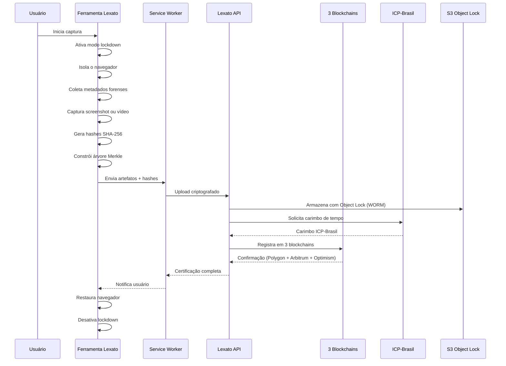
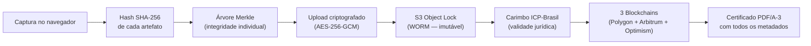
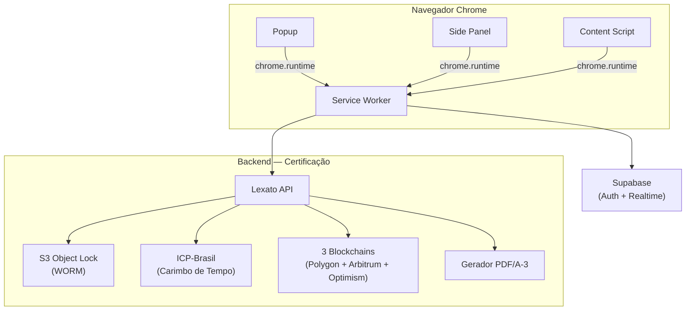

<p align="center">
  <a href="https://lexato.com.br">
    
  </a>
</p>

<h1 align="center">Lexato — Captura de Provas Digitais</h1>

<p align="center">
  A primeira e única ferramenta de captura de provas digitais 100% Open Source do Brasil.<br/>
  Código aberto, auditável e verificável por qualquer pessoa.
</p>

<p align="center">
  <a href="https://github.com/LexatoBR/lexato-extension"></a>
  <a href="LICENSE"></a>
  <a href="https://chromewebstore.google.com"></a>
  <a href="https://developer.chrome.com/docs/extensions/mv3/"></a>
  <a href="SECURITY.md"></a>
  <a href="https://github.com/LexatoBR/lexato-extension"></a>
</p>

---

## Sumário

- [Por que Open Source?](#por-que-open-source)
- [O que é a Lexato?](#o-que-é-a-lexato)
- [Recursos exclusivos](#recursos-exclusivos)
- [Como funciona](#como-funciona)
- [Segurança: Zero Trust](#segurança-zero-trust)
- [Comparativo](#comparativo)
- [Início rápido](#início-rápido)
- [Estrutura do projeto](#estrutura-do-projeto)
- [Scripts disponíveis](#scripts-disponíveis)
- [Contribuindo](#contribuindo)
- [Licença](#licença)

---

## Por que Open Source?

No universo forense, uma prova digital só tem valor real quando o processo de coleta pode ser verificado de ponta a ponta. Não basta afirmar que o sistema é seguro — é preciso demonstrar. E a única forma de demonstrar é abrindo o código.

A [Lexato](https://lexato.com.br) tomou uma decisão que nenhuma outra empresa do setor no Brasil tomou: publicar integralmente o código-fonte da ferramenta de captura. Isso significa que advogados, peritos judiciais, pesquisadores de segurança e magistrados podem inspecionar cada linha de código e entender exatamente o que acontece no momento em que uma evidência é coletada.

Ao examinar este repositório, qualquer pessoa pode verificar:

- Como os hashes SHA-256 são gerados e encadeados para formar a cadeia de custódia digital
- Como a árvore Merkle é construída, garantindo que cada artefato possa ser validado individualmente
- Como o modo lockdown isola o navegador durante a captura, impedindo qualquer interferência externa
- Como os metadados forenses — DNS, WHOIS, geolocalização, headers HTTP, certificados SSL — são coletados de forma automatizada
- Como toda comunicação com o backend é autenticada e protegida por criptografia

Soluções proprietárias pedem que você confie cegamente no que acontece por trás de uma interface fechada. A Lexato pede que você verifique por conta própria. Essa é a diferença entre confiança declarada e confiança verificável.

---

## O que é a Lexato?

A [Lexato](https://lexato.com.br) é uma plataforma brasileira de certificação de provas digitais com validade jurídica. Projetada para advogados, escritórios de advocacia, departamentos jurídicos e profissionais que lidam com evidências digitais no dia a dia, a plataforma resolve um problema concreto: garantir que uma captura de tela ou gravação de vídeo tenha força probatória em juízo.

Para alcançar esse objetivo, a Lexato combina três pilares de certificação que, juntos, tornam a evidência praticamente incontestável:

| Pilar | Tecnologia | O que garante |
|-------|------------|---------------|
| **Blockchain** | Polygon, Arbitrum, Optimism | Registro imutável e descentralizado em 3 redes simultâneas — se uma rede falhar, as outras duas mantêm a prova |
| **ICP-Brasil** | Autoridade Certificadora credenciada | Carimbo de tempo com validade jurídica reconhecida pelo Poder Judiciário brasileiro |
| **Armazenamento WORM** | AWS S3 Object Lock | Evidências gravadas uma única vez e que não podem ser alteradas nem excluídas — nem pela própria Lexato |

Esta ferramenta é o ponto de entrada de todo o processo. Ela captura a evidência diretamente no navegador, coleta metadados forenses de forma automatizada e envia tudo ao backend da [Lexato](https://lexato.com.br), onde a certificação blockchain, o carimbo ICP-Brasil e o armazenamento imutável completam a cadeia de custódia.

Conheça a plataforma completa em **[lexato.com.br](https://lexato.com.br)**.

---

## Recursos exclusivos

A Lexato reúne tecnologias e funcionalidades que não existem em nenhuma outra ferramenta de certificação digital no mercado brasileiro. Cada recurso foi escolhido para resolver um problema real do processo de coleta e preservação de provas:

| | Recurso | Por que importa |
|---|---------|-----------------|
| **Zero Trust** | Arquitetura de segurança | Nenhum componente confia implicitamente em outro. Cada requisição é autenticada, cada hash é recalculado, cada artefato é validado antes de avançar na cadeia de custódia. |
| **3 Blockchains** | Redundância descentralizada | O registro simultâneo em Polygon, Arbitrum e Optimism elimina o risco de ponto único de falha. Mesmo que uma rede inteira saia do ar, a prova permanece certificada nas outras duas. |
| **100% Open Source** | Transparência verificável | A Lexato é a única ferramenta de captura de provas digitais do Brasil com código-fonte integralmente aberto. Qualquer pessoa pode auditar, compilar e verificar o comportamento do sistema. |
| **ML-DSA-87** | Criptografia pós-quântica | Assinatura digital baseada no padrão FIPS 204, resistente a ataques de computação quântica. Provas assinadas hoje continuarão válidas mesmo quando computadores quânticos se tornarem viáveis. |
| **AES-256-GCM** | Criptografia FIPS 140-3 | Padrão federal americano para proteção de dados sensíveis. Tokens e credenciais armazenados localmente são criptografados com o mesmo nível de segurança exigido por agências governamentais. |
| **S3 Object Lock** | Armazenamento WORM | Write Once, Read Many — uma vez gravada, a evidência não pode ser alterada nem excluída por ninguém, nem mesmo pela equipe da Lexato. Imutabilidade garantida por infraestrutura. |
| **Suporte 24/7** | Atendimento contínuo | Questões técnicas e jurídicas atendidas a qualquer hora via [lexato.com.br/suporte](https://lexato.com.br/suporte). |


### O que a ferramenta faz na prática

Durante uma captura, o sistema executa automaticamente uma série de operações forenses que seriam impossíveis de realizar manualmente:

- **Captura de screenshot e vídeo** com hash criptográfico SHA-256 gerado no instante exato da coleta
- **Coleta forense automatizada** — IP de origem, geolocalização, registros DNS, WHOIS, cabeçalhos HTTP e certificados SSL da página capturada
- **Modo lockdown** — desativa DevTools e ferramentas de terceiros durante a captura, eliminando qualquer possibilidade de manipulação
- **Isolamento do navegador** — desativa temporariamente todas as outras ferramentas do Chrome durante a gravação de vídeo
- **Árvore Merkle** — estrutura criptográfica que permite verificar a integridade de cada artefato individualmente, sem precisar revalidar o conjunto inteiro
- **Cadeia de custódia digital** — rastreabilidade completa desde o clique de captura até a certificação final em blockchain
- **Certificação blockchain** automática em três redes simultâneas (Polygon, Arbitrum e Optimism)
- **Carimbo de tempo ICP-Brasil** — validade jurídica emitida por Autoridade Certificadora credenciada
- **Sincronização em tempo real** com o painel [Lexato](https://lexato.com.br) via Supabase Realtime
- **Histórico de capturas** acessível diretamente pelo Side Panel do Chrome
- **Internacionalização** — interface disponível em português, inglês e espanhol

---

## Como funciona

### Fluxo de captura

O diagrama abaixo mostra o caminho completo de uma evidência, desde o momento em que o usuário clica em "Capturar" até a certificação final em blockchain:



### Cadeia de custódia

Cada etapa da cadeia de custódia é verificável e auditável. O artefato nunca é modificado após a captura — apenas novos registros de certificação são adicionados:



### Arquitetura

A ferramenta segue a arquitetura Manifest V3 do Chrome, com Service Worker isolado como ponto central de comunicação:



---

## Segurança: Zero Trust

A [Lexato](https://lexato.com.br) foi construída sobre o princípio de que nenhum componente do sistema deve confiar em outro sem verificação. Essa abordagem, conhecida como Zero Trust, permeia toda a arquitetura — do navegador ao armazenamento final.

Na prática, isso significa que um token válido não é suficiente para completar uma operação. Cada etapa da cadeia de custódia recalcula hashes, revalida permissões e verifica a integridade dos artefatos antes de prosseguir. Se qualquer verificação falhar, a operação é interrompida.

### Princípios

| Princípio | Como a Lexato aplica |
|-----------|----------------------|
| **Nunca confiar, sempre verificar** | Tokens JWT validados em cada requisição. Hashes recalculados em cada etapa da cadeia de custódia. |
| **Menor privilégio** | Permissões declaradas no manifest são as mínimas necessárias. `activeTab` em vez de `<all_urls>`. |
| **Verificação contínua** | Integridade do DOM monitorada durante toda a captura via `MutationObserver`. DevTools detectados em tempo real. |
| **Criptografia em trânsito e em repouso** | HTTPS obrigatório para toda comunicação. AES-256-GCM (FIPS 140-3) para armazenamento local. |
| **Isolamento de contexto** | Service Worker isolado conforme Manifest V3. Ferramentas de terceiros desativadas durante captura. |
| **Auditabilidade total** | Código 100% Open Source. Logs de auditoria com correlation ID em cada operação. |

### Transparência

A decisão de publicar o código-fonte não foi um gesto simbólico. A Lexato acredita que transparência é um requisito técnico para qualquer sistema que lida com provas judiciais. Código fechado é, por definição, inverificável — e evidências produzidas por sistemas inverificáveis são vulneráveis a contestação.

Com o código aberto, qualquer pesquisador de segurança pode auditar o comportamento do sistema, identificar vulnerabilidades e propor correções. Todas as alterações são rastreáveis pelo histórico de commits, e nenhum dado é coletado sem consentimento explícito do usuário.

### Privacidade

A Lexato coleta apenas o que é estritamente necessário para a certificação da prova. Fora do momento da captura, a ferramenta não monitora, não rastreia e não acessa dados do navegador:

- Dados do usuário nunca saem do dispositivo sem ação explícita de captura
- Geolocalização é solicitada antes de cada captura e nunca coletada em segundo plano
- Autenticação via tokens JWT armazenados localmente com criptografia — sem cookies de rastreamento
- A ferramenta só interage com a aba ativa no momento da captura — sem acesso a histórico de navegação
- Conformidade integral com a LGPD (Lei Geral de Proteção de Dados)

### Conformidade

| Padrão | Aplicação |
|--------|-----------|
| **FIPS 140-3** | Criptografia AES-256-GCM para armazenamento local |
| **FIPS 204 (ML-DSA-87)** | Assinatura digital pós-quântica |
| **ISO/IEC 27037** | Coleta e preservação de evidências digitais |
| **CPP Arts. 158-A a 158-F** | Cadeia de custódia conforme Código de Processo Penal |
| **ICP-Brasil** | Carimbo de tempo com validade jurídica |
| **LGPD** | Proteção de dados pessoais |

<details>
<summary>Medidas técnicas detalhadas</summary>

- Content Security Policy restritiva — sem `unsafe-eval`, sem `unsafe-inline`
- Source maps nunca incluídos no bundle de produção
- S3 Object Lock (WORM) — evidências armazenadas de forma imutável
- Testes de propriedade (property-based testing) para validação de invariantes criptográficas
- Circuit breaker por serviço para resiliência contra falhas em cascata
- Manifest V3 — arquitetura mais segura do Chrome com Service Worker isolado

</details>

Para reportar vulnerabilidades, consulte [SECURITY.md](SECURITY.md).

---

## Comparativo

A tabela abaixo compara a Lexato com as soluções proprietárias disponíveis no mercado brasileiro de certificação digital. Os dados refletem funcionalidades publicamente documentadas:

| Característica | Lexato | Soluções proprietárias |
|----------------|--------|------------------------|
| Código-fonte | 100% Open Source e auditável | Fechado |
| Arquitetura Zero Trust | Verificação contínua em cada etapa | Não documentado |
| Auditoria independente | Qualquer pessoa pode auditar | Indisponível |
| Blockchain | 3 redes simultâneas (Polygon + Arbitrum + Optimism) | 1 rede ou nenhuma |
| Criptografia pós-quântica | ML-DSA-87 (FIPS 204) | Indisponível |
| Armazenamento imutável | S3 Object Lock (WORM) | Variável |
| Carimbo ICP-Brasil | Sim | Variável |
| Coleta forense | DNS, WHOIS, geolocalização, SSL, HTTP headers | Parcial |
| Modo lockdown | DevTools e ferramentas de terceiros desativados | Indisponível |
| Privacidade (LGPD) | Sem telemetria oculta; geolocalização com consentimento | Variável |
| Internacionalização | pt-BR, en, es | Geralmente 1 idioma |

---

## Início rápido

### Pré-requisitos

| Ferramenta | Versão mínima |
|------------|---------------|
| Node.js    | 20.x          |
| npm        | 10.x          |
| Chrome     | 116+          |

### Instalação

```bash
# 1. Clone o repositório
git clone https://github.com/LexatoBR/lexato-extension.git
cd lexato-extension

# 2. Instale as dependências
npm install

# 3. Configure as variáveis de ambiente
cp .env.example .env.local
# Edite .env.local com suas credenciais (veja .env.example)

# 4. Build de desenvolvimento
npm run dev
```

### Carregando no Chrome

1. Abra `chrome://extensions/`
2. Ative **"Modo do desenvolvedor"** (canto superior direito)
3. Clique em **"Carregar sem compactação"**
4. Selecione a pasta `dist/` gerada

---

## Estrutura do projeto

```
src/
├── background/           # Service Worker — orquestração, autenticação, API
├── config/               # Configuração de ambientes
├── content/              # Content Scripts — injeção em páginas web
├── capture-bridge/       # Bridge de comunicação para captura
├── hooks/                # React hooks compartilhados
├── lib/                  # Bibliotecas core
│   ├── csp/              # Content Security Policy builder
│   ├── crypto/           # Criptografia, hashing e AES-256-GCM
│   ├── evidence-pipeline/# Pipeline de processamento de evidências
│   ├── forensic/         # Coleta forense (DNS, WHOIS, geolocalização)
│   ├── notifications/    # Notificações em tempo real (Supabase Realtime)
│   └── supabase/         # Cliente Supabase
├── offscreen/            # Documento offscreen (APIs que requerem DOM)
├── options/              # Página de configurações
├── overlay/              # UI de overlay durante captura
├── popup/                # Interface principal
├── preview/              # Preview de capturas
├── sidepanel/            # Side Panel — controles de gravação
├── store/                # Estado global (Zustand + chrome.storage)
├── styles/               # Design tokens
├── types/                # Tipos TypeScript compartilhados
└── manifest.ts           # Definição do Manifest V3
tests/
├── unit/                 # Testes unitários (Vitest)
├── integration/          # Testes de integração
└── property/             # Testes de propriedade (fast-check)
```

---

## Scripts disponíveis

| Comando | Descrição |
|---------|-----------|
| `npm run dev` | Build de desenvolvimento com watch |
| `npm run build` | Build de produção |
| `npm run build:prod` | Build + validação do manifest |
| `npm run typecheck` | Verificação de tipos TypeScript |
| `npm run lint` | Lint do código |
| `npm run lint:fix` | Lint com correção automática |
| `npm run test` | Testes unitários |
| `npm run test:watch` | Testes em modo watch |
| `npm run test:coverage` | Cobertura de testes |

---

## Contribuindo

Contribuições são bem-vindas. Consulte [CONTRIBUTING.md](CONTRIBUTING.md) para o guia completo.

A [Lexato](https://lexato.com.br) valoriza especialmente contribuições em auditorias de segurança, testes de propriedade para invariantes criptográficas, novos collectors forenses, traduções para outros idiomas e documentação técnica e jurídica sobre o processo de certificação.

---

## Licença

Apache 2.0 — consulte [LICENSE](LICENSE) para detalhes.

Copyright (c) 2024-2026 [Lexato](https://lexato.com.br). Todos os direitos reservados.

---

<p align="center">
  Desenvolvido com arquitetura Zero Trust por <a href="https://lexato.com.br">Lexato</a><br/>
  Transparência, segurança e validade jurídica para provas digitais no Brasil.
</p>
