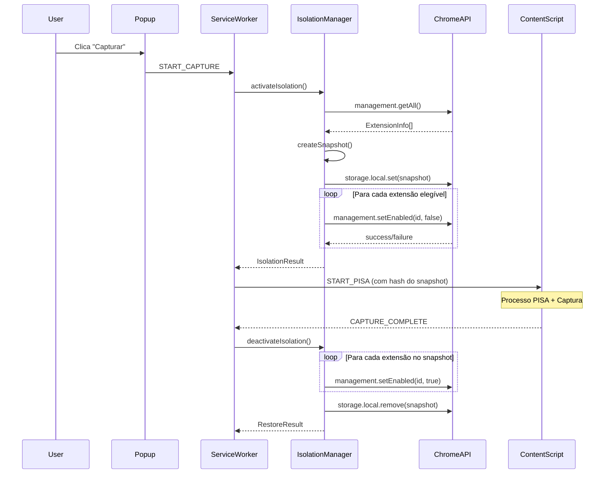

# Arquitetura da Extensão Chrome

Este documento descreve a arquitetura técnica da extensão Chrome do Lexato.

## Índice

- [Visão Geral](#visão-geral)
- [Componentes Principais](#componentes-principais)
- [Comunicação entre Componentes](#comunicação-entre-componentes)
- [Gerenciamento de Estado](#gerenciamento-de-estado)
- [Fluxo de Dados](#fluxo-de-dados)
- [Segurança](#segurança)
- [Integração com Backend](#integração-com-backend)

## Visão Geral

A extensão segue a arquitetura Manifest V3 do Chrome, com separação clara entre:

```
┌─────────────────────────────────────────────────────────────────┐
│                    ARQUITETURA GERAL                            │
├─────────────────────────────────────────────────────────────────┤
│                                                                 │
│  ┌─────────────────────────────────────────────────────────┐   │
│  │                    CHROME BROWSER                        │   │
│  │  ┌─────────────────────────────────────────────────────┐│   │
│  │  │                  SERVICE WORKER                      ││   │
│  │  │  ┌─────────┐ ┌─────────┐ ┌─────────┐ ┌───────────┐  ││   │
│  │  │  │  Auth   │ │   API   │ │ Upload  │ │ Notifica- │  ││   │
│  │  │  │ Manager │ │ Client  │ │ Handler │ │   tions   │  ││   │
│  │  │  └─────────┘ └─────────┘ └─────────┘ └───────────┘  ││   │
│  │  └─────────────────────────────────────────────────────┘│   │
│  │                          │                               │   │
│  │                          │ chrome.runtime                │   │
│  │                          ▼                               │   │
│  │  ┌─────────────────────────────────────────────────────┐│   │
│  │  │                  CONTENT SCRIPTS                     ││   │
│  │  │  ┌─────────┐ ┌─────────┐ ┌─────────┐ ┌───────────┐  ││   │
│  │  │  │Lockdown │ │Screenshot│ │  Video  │ │ Metadata  │  ││   │
│  │  │  │ Manager │ │ Capture │ │ Capture │ │ Collector │  ││   │
│  │  │  └─────────┘ └─────────┘ └─────────┘ └───────────┘  ││   │
│  │  └─────────────────────────────────────────────────────┘│   │
│  │                          │                               │   │
│  │                          │ DOM                           │   │
│  │                          ▼                               │   │
│  │  ┌─────────────────────────────────────────────────────┐│   │
│  │  │                    WEB PAGE                          ││   │
│  │  └─────────────────────────────────────────────────────┘│   │
│  └─────────────────────────────────────────────────────────┘   │
│                                                                 │
│  ┌─────────────────────────────────────────────────────────┐   │
│  │                      UI COMPONENTS                       │   │
│  │  ┌─────────┐ ┌─────────┐ ┌─────────┐                    │   │
│  │  │  Popup  │ │ Options │ │ Overlay │                    │   │
│  │  │   UI    │ │  Page   │ │         │                    │   │
│  │  └─────────┘ └─────────┘ └─────────┘                    │   │
│  └─────────────────────────────────────────────────────────┘   │
│                                                                 │
└─────────────────────────────────────────────────────────────────┘
```

## Componentes Principais

### 1. Service Worker (Background)

O Service Worker é o coração da extensão, responsável por:

| Componente | Arquivo | Responsabilidade |
|------------|---------|------------------|
| ServiceWorker | `service-worker.ts` | Orquestração geral |
| AuthManager | `auth-manager.ts` | Autenticação Cognito |
| APIClient | `api-client.ts` | Comunicação HTTP |
| UploadHandler | `upload-handler.ts` | Upload para S3 |
| BackendIntegration | `backend-integration.ts` | Integração PCC 3-5 |
| NotificationManager | `notification-manager.ts` | Notificações Chrome |
| ExtensionIsolationManager | `extension-isolation-manager.ts` | Isolamento de extensões |

```typescript
// src/background/service-worker.ts

// Gerencia tokens de autenticação
const authManager = new AuthManager();

// Cliente HTTP com interceptors
const apiClient = new APIClient(authManager);

// Handler de upload com retry
const uploadHandler = new UploadHandler(apiClient);

// Integração com backend para PCC 3-5
const backendIntegration = new BackendIntegration(apiClient);

// Listener de mensagens
chrome.runtime.onMessage.addListener((message, sender, sendResponse) => {
  handleMessage(message, sender).then(sendResponse);
  return true; // Indica resposta assíncrona
});
```

### 2. Content Scripts

Executam no contexto da página web:

| Componente | Arquivo | Responsabilidade |
|------------|---------|------------------|
| LockdownManager | `lockdown-manager.ts` | Proteções de segurança |
| DOMIntegrityMonitor | `dom-integrity-monitor.ts` | Monitoramento DOM |
| ScreenshotCapture | `screenshot-capture.ts` | Captura de screenshot |
| VideoCapture | `video-capture.ts` | Gravação de vídeo |
| FrameExtractor | `frame-extractor.ts` | Extração de frames |
| MetadataCollector | `metadata-collector.ts` | Coleta de metadados |

### 3. Bibliotecas Compartilhadas (lib/)

| Componente | Arquivo | Responsabilidade |
|------------|---------|------------------|
| CryptoUtils | `crypto-utils.ts` | Utilitários criptográficos |
| HashGenerator | `hash-generator.ts` | Geração de hashes |
| MerkleTree | `merkle-tree.ts` | Árvore Merkle |
| PISAProcess | `pisa-process.ts` | Processo PISA |
| PCCLocal | `pcc-local.ts` | PCC níveis 1-2 |
| CircuitBreaker | `circuit-breaker.ts` | Circuit Breaker |
| RetryHandler | `retry-handler.ts` | Retry com backoff |
| AuditLogger | `audit-logger.ts` | Logger de auditoria |
| Errors | `errors.ts` | Tratamento de erros |

### 4. UI Components

| Componente | Diretório | Responsabilidade |
|------------|-----------|------------------|
| Popup | `popup/` | Interface principal |
| Options | `options/` | Configurações |
| Overlay | `overlay/` | Feedback durante captura |

## Comunicação entre Componentes

### Mensagens Chrome Runtime

```typescript
// Popup → Service Worker
chrome.runtime.sendMessage({
  type: 'START_CAPTURE',
  payload: { captureType: 'screenshot', storageType: 'premium_5y' }
});

// Service Worker → Content Script
chrome.tabs.sendMessage(tabId, {
  type: 'ACTIVATE_LOCKDOWN'
});

// Content Script → Service Worker
chrome.runtime.sendMessage({
  type: 'CAPTURE_COMPLETE',
  payload: { data, hashes }
});
```

### Tipos de Mensagens

```typescript
// src/types/messages.ts

type MessageType =
  // Autenticação
  | 'LOGIN'
  | 'LOGOUT'
  | 'REFRESH_TOKEN'
  
  // Captura
  | 'START_CAPTURE'
  | 'STOP_CAPTURE'
  | 'CAPTURE_PROGRESS'
  | 'CAPTURE_COMPLETE'
  | 'CAPTURE_ERROR'
  
  // Lockdown
  | 'ACTIVATE_LOCKDOWN'
  | 'DEACTIVATE_LOCKDOWN'
  | 'LOCKDOWN_VIOLATION'
  
  // PISA
  | 'VERIFY_PAGE_LOADED'
  | 'PISA_STAGE_COMPLETE'
  
  // Upload
  | 'UPLOAD_PROGRESS'
  | 'UPLOAD_COMPLETE';
```

## Gerenciamento de Estado

### Zustand Stores

```
┌────────────────────────────────────────────────────────────────┐
│                    ZUSTAND STORES                              │
├────────────────────────────────────────────────────────────────┤
│                                                                │
│  ┌─────────────────────────────────────────────────────────┐  │
│  │                    auth-store.ts                         │  │
│  │  ├── user: User | null                                   │  │
│  │  ├── isAuthenticated: boolean                            │  │
│  │  ├── isLoading: boolean                                  │  │
│  │  └── error: string | null                                │  │
│  └─────────────────────────────────────────────────────────┘  │
│                                                                │
│  ┌─────────────────────────────────────────────────────────┐  │
│  │                   capture-store.ts                       │  │
│  │  ├── currentCapture: Capture | null                      │  │
│  │  ├── recentCaptures: Capture[]                           │  │
│  │  ├── isCapturing: boolean                                │  │
│  │  └── progress: number                                    │  │
│  └─────────────────────────────────────────────────────────┘  │
│                                                                │
│  ┌─────────────────────────────────────────────────────────┐  │
│  │                  settings-store.ts                       │  │
│  │  ├── defaultStorageType: StorageType                     │  │
│  │  ├── captureQuality: 'high' | 'medium'                   │  │
│  │  └── notificationsEnabled: boolean                       │  │
│  └─────────────────────────────────────────────────────────┘  │
│                                                                │
└────────────────────────────────────────────────────────────────┘
```

### Persistência

```typescript
// src/store/settings-store.ts

import { create } from 'zustand';
import { persist } from 'zustand/middleware';

export const useSettingsStore = create(
  persist(
    (set) => ({
      defaultStorageType: 'standard',
      captureQuality: 'high',
      notificationsEnabled: true,
      
      setDefaultStorageType: (type) => set({ defaultStorageType: type }),
      setCaptureQuality: (quality) => set({ captureQuality: quality }),
      setNotificationsEnabled: (enabled) => set({ notificationsEnabled: enabled }),
    }),
    {
      name: 'lexato-settings',
      storage: {
        getItem: async (name) => {
          const result = await chrome.storage.local.get(name);
          return result[name] || null;
        },
        setItem: async (name, value) => {
          await chrome.storage.local.set({ [name]: value });
        },
        removeItem: async (name) => {
          await chrome.storage.local.remove(name);
        },
      },
    }
  )
);
```

## Fluxo de Dados

### Fluxo de Captura Completo

```
┌────────────────────────────────────────────────────────────────┐
│                    FLUXO DE DADOS                              │
├────────────────────────────────────────────────────────────────┤
│                                                                │
│  POPUP                                                         │
│  ┌─────────────────────────────────────────────────────────┐  │
│  │ 1. Usuário clica "Capturar"                              │  │
│  │    └── dispatch: START_CAPTURE                           │  │
│  └─────────────────────────────────────────────────────────┘  │
│                          │                                     │
│                          ▼                                     │
│  SERVICE WORKER                                                │
│  ┌─────────────────────────────────────────────────────────┐  │
│  │ 2. Recebe START_CAPTURE                                  │  │
│  │    ├── Valida autenticação                               │  │
│  │    ├── Verifica créditos                                 │  │
│  │    └── Inicia PISA                                       │  │
│  └─────────────────────────────────────────────────────────┘  │
│                          │                                     │
│                          ▼                                     │
│  CONTENT SCRIPT                                                │
│  ┌─────────────────────────────────────────────────────────┐  │
│  │ 3. Executa PISA                                          │  │
│  │    ├── H0 → H1 → H2 → H3 → H4                            │  │
│  │    └── HASH_CADEIA                                       │  │
│  │                                                          │  │
│  │ 4. Ativa Lockdown                                        │  │
│  │    └── Proteções ativas                                  │  │
│  │                                                          │  │
│  │ 5. Captura dados                                         │  │
│  │    ├── Screenshot/Vídeo                                  │  │
│  │    ├── HTML                                              │  │
│  │    └── Metadados                                         │  │
│  │                                                          │  │
│  │ 6. Gera hashes                                           │  │
│  │    └── hashes.json                                       │  │
│  │                                                          │  │
│  │ 7. PCC Níveis 1-2                                        │  │
│  │    ├── Merkle Tree                                       │  │
│  │    └── Hash_N2                                           │  │
│  └─────────────────────────────────────────────────────────┘  │
│                          │                                     │
│                          ▼                                     │
│  SERVICE WORKER                                                │
│  ┌─────────────────────────────────────────────────────────┐  │
│  │ 8. Upload para S3                                        │  │
│  │    ├── Solicita presigned URL                            │  │
│  │    └── Upload com retry                                  │  │
│  │                                                          │  │
│  │ 9. Notifica backend                                      │  │
│  │    └── Inicia PCC 3-5                                    │  │
│  └─────────────────────────────────────────────────────────┘  │
│                          │                                     │
│                          ▼                                     │
│  BACKEND                                                       │
│  ┌─────────────────────────────────────────────────────────┐  │
│  │ 10. PCC Níveis 3-5                                       │  │
│  │     ├── ICP-Brasil (TSA)                                 │  │
│  │     ├── Blockchain (Polygon + Arbitrum + Optimism)           │  │
│  │     └── PDF                                              │  │
│  │                                                          │  │
│  │ 11. Notifica via WebSocket                               │  │
│  └─────────────────────────────────────────────────────────┘  │
│                          │                                     │
│                          ▼                                     │
│  POPUP                                                         │
│  ┌─────────────────────────────────────────────────────────┐  │
│  │ 12. Exibe notificação de conclusão                       │  │
│  └─────────────────────────────────────────────────────────┘  │
│                                                                │
└────────────────────────────────────────────────────────────────┘
```

## Segurança

### Manifest V3 Permissions

```json
{
  "permissions": [
    "activeTab",
    "storage",
    "tabs",
    "scripting",
    "notifications",
    "alarms"
  ],
  "host_permissions": [
    "https://*/*",
    "http://*/*"
  ]
}
```

### Content Security Policy

```json
{
  "content_security_policy": {
    "extension_pages": "script-src 'self'; object-src 'self'"
  }
}
```

### Armazenamento Seguro

- Tokens armazenados em `chrome.storage.local`
- Nunca em localStorage ou cookies
- Refresh automático antes da expiração

### Proteções em Runtime

- Object.freeze em protótipos nativos
- MutationObserver para detectar manipulações
- Verificação contínua de DevTools
- Bloqueio de elementos perigosos

## Integração com Backend

### Endpoints Utilizados

| Endpoint | Método | Descrição |
|----------|--------|-----------|
| `/auth/login` | POST | Login com Cognito |
| `/auth/refresh` | POST | Refresh token |
| `/upload/presign` | POST | Solicitar presigned URL |
| `/evidence/create` | POST | Criar evidência |
| `/evidence/status/:id` | GET | Status da certificação |
| `/user/credits` | GET | Saldo de créditos |

### WebSocket

```typescript
// Conexão WebSocket para notificações em tempo real
const ws = new WebSocket('wss://ws.lexato.com.br');

ws.onmessage = (event) => {
  const message = JSON.parse(event.data);
  
  switch (message.type) {
    case 'CERTIFICATION_COMPLETE':
      // Notificar usuário
      break;
    case 'PDF_READY':
      // Atualizar UI
      break;
  }
};
```

### Retry e Circuit Breaker

```typescript
// Configuração de retry por serviço
const retryConfig = {
  'icp-brasil': {
    maxAttempts: 3,
    initialDelay: 1000,
    maxDelay: 30000,
    jitter: 0.3,
  },
  'blockchain': {
    maxAttempts: 5,
    initialDelay: 500,
    maxDelay: 10000,
    jitter: 0.3,
  },
};

// Circuit Breaker por serviço
const circuitBreakerConfig = {
  'icp-brasil': {
    failureThreshold: 5,
    resetTimeout: 300000, // 5 minutos
  },
  'blockchain': {
    failureThreshold: 5,
    resetTimeout: 60000, // 1 minuto
  },
};
```

## Extension Isolation Mode

O Modo de Isolamento de Extensões é uma funcionalidade crítica de segurança que desativa temporariamente todas as outras extensões do Chrome durante a captura.

### Arquitetura do Isolamento

```
┌─────────────────────────────────────────────────────────────────┐
│                    EXTENSION ISOLATION MODE                     │
├─────────────────────────────────────────────────────────────────┤
│                                                                 │
│  ┌─────────────────────────────────────────────────────────┐   │
│  │              ExtensionIsolationManager                   │   │
│  │  ┌─────────────────────────────────────────────────────┐│   │
│  │  │                    Métodos                          ││   │
│  │  │  ├── activateIsolation(): Promise<IsolationResult>  ││   │
│  │  │  ├── deactivateIsolation(): Promise<RestoreResult>  ││   │
│  │  │  ├── getIsolationStatus(): IsolationStatus          ││   │
│  │  │  ├── forceRestore(): Promise<RestoreResult>         ││   │
│  │  │  └── checkPendingSnapshots(): Promise<void>         ││   │
│  │  └─────────────────────────────────────────────────────┘│   │
│  └─────────────────────────────────────────────────────────┘   │
│                                                                 │
│  ┌─────────────────────────────────────────────────────────┐   │
│  │                    Chrome APIs                           │   │
│  │  ├── chrome.management.getAll()                          │   │
│  │  ├── chrome.management.setEnabled(id, enabled)           │   │
│  │  └── chrome.storage.local (snapshot persistence)         │   │
│  └─────────────────────────────────────────────────────────┘   │
│                                                                 │
└─────────────────────────────────────────────────────────────────┘
```

### Fluxo de Isolamento



### Integração com PISA

O isolamento é integrado ao processo PISA como primeira etapa:

1. **Isolamento** → Desativa extensões de terceiros
2. **H0 (PRE_RELOAD)** → Hash inclui hash do snapshot de extensões
3. **H1-H4** → Processo PISA normal
4. **Captura** → Evidência capturada
5. **Restauração** → Extensões restauradas (sempre, mesmo em erro)

### Snapshot de Extensões

```typescript
interface ExtensionSnapshot {
  id: string;                    // ID único do snapshot
  correlationId: string;         // CorrelationId da captura
  createdAt: number;             // Timestamp de criação
  extensions: ExtensionEntry[];  // Lista de extensões
  hash: string;                  // SHA-256 para validação
  lexatoExtensionId: string;     // ID da extensão Lexato
}

interface ExtensionEntry {
  id: string;
  name: string;
  wasEnabled: boolean;
  mayDisable: boolean;
  installType: string;
  type: string;
  version: string;
}
```

### Recuperação de Falhas

O sistema implementa recuperação automática:

1. **Startup**: Verifica snapshots pendentes e restaura extensões
2. **Timeout**: Snapshots órfãos são limpos após 1 hora
3. **Falha de restauração**: Snapshot mantido para retry manual
4. **Erro não tratado**: Restauração garantida via `finally`

---

**Documentação relacionada:**
- [README.md](../README.md) - Visão geral do projeto
- [DEVELOPMENT.md](./DEVELOPMENT.md) - Processos core
